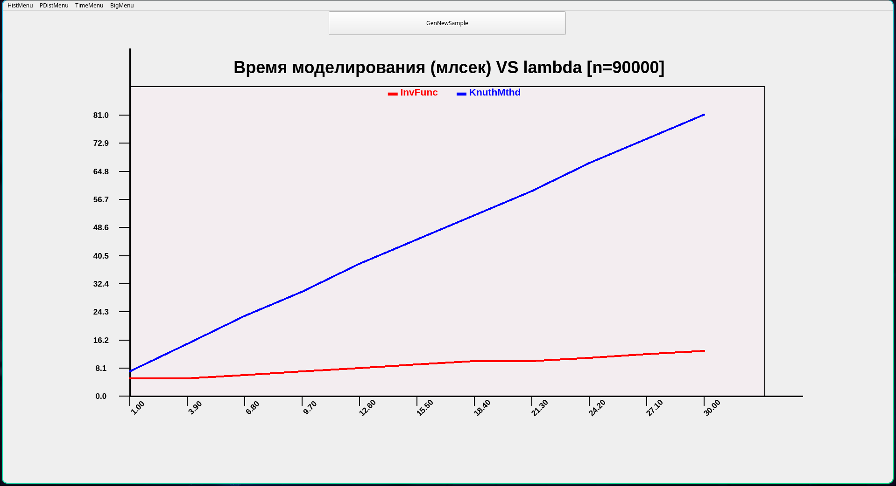
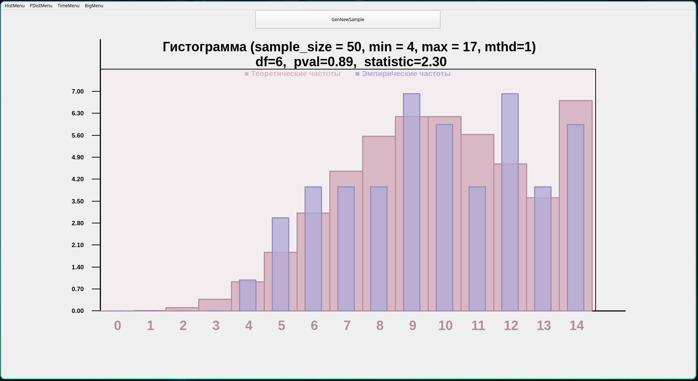
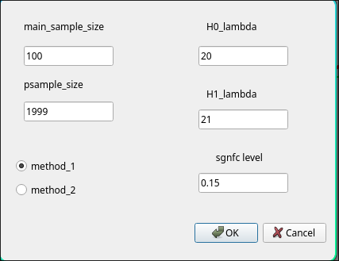
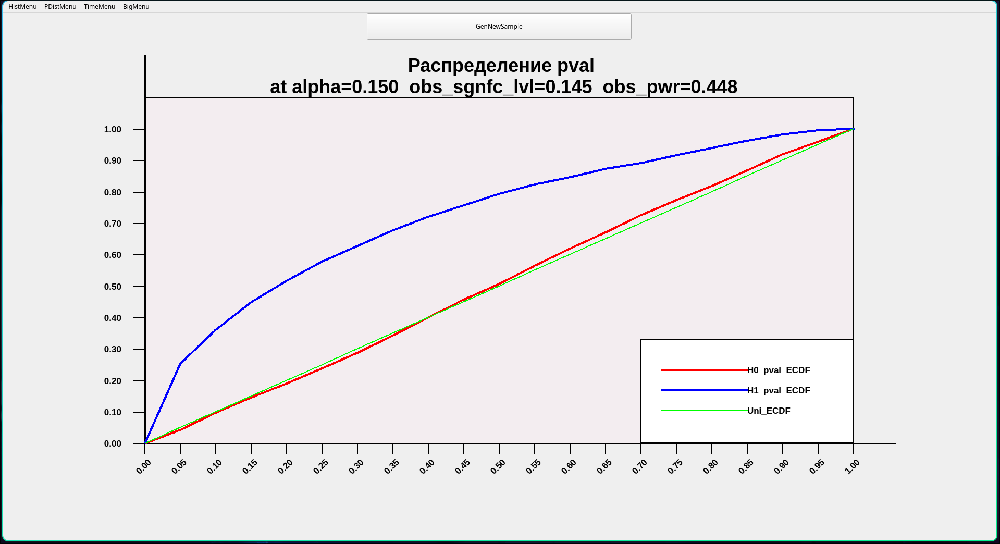

# Poiss + Chisq 
В данном репозитории содержится исходный код для программы, \
которая позволяет моделировать распределение пуассона двумя \
методами (метод обратной функции и метод кнута) и смотреть что вышло. \

### v1
Например, можно озаботиться скоростью работы одного метода относительно другого:

### v2
Также, можно задать два параметра $\lambda_1$
и получить выборку из $\text{Pois}(\lambda_1)$
после этого будет посчитана статистика хи-квадрат для проверки гипотезы о \
равенстве наблюдаемого распределения распределению $\text{Pois}(\lambda_1)$.

### v3
Предположим что мы имеем дело с распределением $\text{Pois}(\lambda)$.
Рассмотрим гипотезу $H_0: \lambda = \lambda_0$ и альтернативу $H_1: \lambda = \lambda_1$. \
Всем нам прекрасно известно, чем примечательно распределение p-value
при верной H0 и при верной H1. \
Выбрав значения параметров:

можно будет построить соответствующие графики:

### P.S.
Вроде бы< для того чтобы запустить это достаточно иметь \
QtCreator и скормить ему директорию в которой лежит файл .pro
(в данном репозитории это ./big_prog/)
