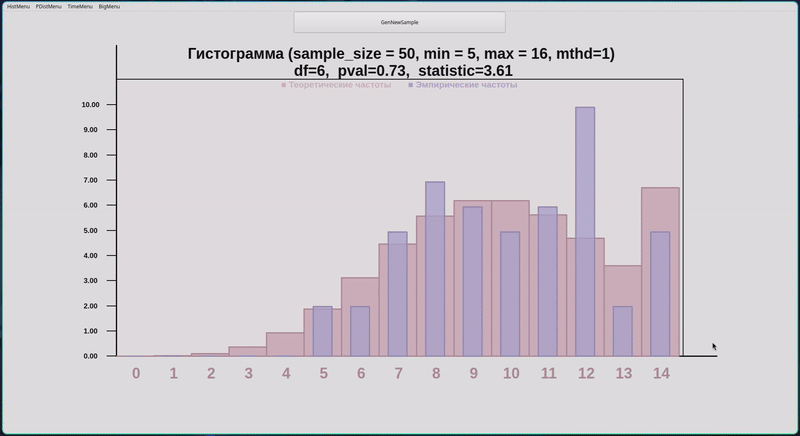
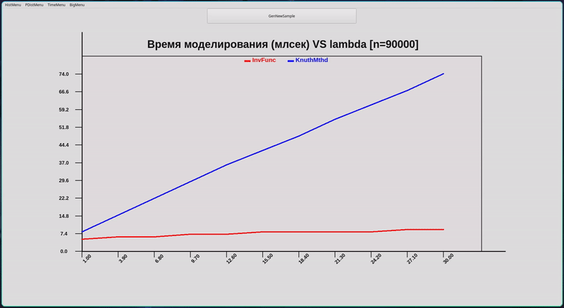
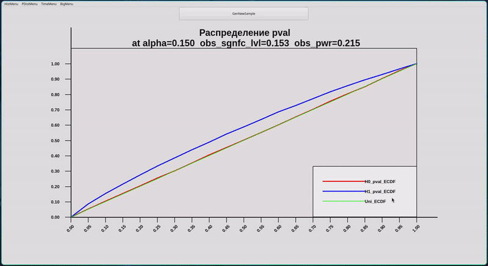

# Poiss + Chisq 
В данном репозитории содержится исходный код для программы, которая позволяет моделировать распределение пуассона двумя 
методами (метод обратной функции и метод кнута) и обсчитывать p-val для теста chisq и всё это упаковано через Qt5 на плюсах. 

## Demo

### v1
Например, можно задать параметр $\lambda_1$ и сгенерировать выборку из $\text{Pois}(\lambda_1)$ после этого 
будет посчитана статистика хи-квадрат для проверки гипотезы о 
равенстве наблюдаемого распределения распределению $\text{Pois}(\lambda_1)$.

</img>


### v2
Также, можно озаботиться скоростью работы одного метода относительно другого:

</img>


### v3
Предположим что мы имеем дело с распределением $\text{Pois}(\lambda)$.  
Рассмотрим гипотезу $H_0: \lambda = \lambda_0$ и альтернативу $H_1: \lambda = \lambda_1$.  
Всем нам прекрасно известно, чем примечательно распределение p-value при верной H0 и при верной H1.  
Выбрав значения параметров
можно будет построить соответствующие графики:

</img>

Как нетрудно заметить, распределение pval при $H_0$ действительно очень близко к $U[0,1]$.
Это сообщает нам о том, что, скорее всего, моделирование проводится корректно. 

## Сборка и запуск
Вам понадобятся `Qt5`, `qmake`, `gcc` | `g++`

Из корня проекта выполните
```bash
./build.sh
```
(в качестве альтернативы можно прописать всё то же самое руками)

После этого запустите бинарник

```bash
./build/big_prog
```

## Docs
Парочку примеров использования всех классов что есть в коде можно найти тут: `./docs/html/index.html`